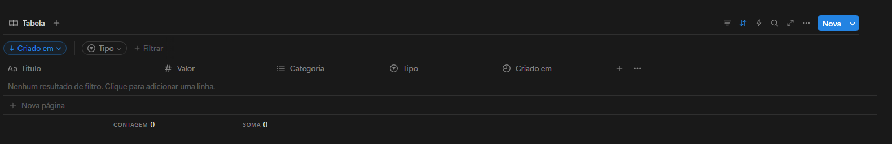

# API Controle Financeiro Notion

Esta API permite registrar e controlar transações financeiras integrando com o Notion, facilitando o gerenciamento de entradas e saídas por meio de comandos simples.

## Funcionalidades

- Recebe comandos via requisições HTTP para registrar transações financeiras.
- Integração com o Notion para armazenamento dos dados.
- Suporte a comandos no formato:
  - `/++ descrição - valor - categoria` para adicionar uma entrada
  - `/-- descrição - valor - categoria` para adicionar uma saída

## Como usar

### 1. Clone o repositório

```bash
git clone https://github.com/ArthurSilv4/api-controleFinanceiroNotion.git
cd api-controleFinanceiroNotion
```

### 2. Configure o arquivo `appsettings.Development.json`

Adicione suas credenciais do Notion na seção `Notion`:

```json
"Notion": {
  "Token": "seu_token_notion",
  "Database": "seu_database_id",
  "Version": "2022-06-28"
}
```

### 3. Execute a aplicação

Você pode executar a aplicação de três formas:

#### Usando Docker

```bash
docker build -t api-controle-financeiro-notion .
docker run -d -p 5000:5000 --name api-controle-financeiro-notion ^
  -v ${PWD}/appsettings.Development.json:/app/appsettings.Development.json ^
  api-controle-financeiro-notion
```

#### Usando .NET CLI

```bash
dotnet run
```

#### Ou diretamente pelo Visual Studio Code

Basta pressionar **F5** para iniciar a aplicação em modo de depuração.

A API estará disponível em `http://localhost:5000` (ou na porta configurada).

### 4. Envie comandos para a API

- Para adicionar uma entrada:

  Faça uma requisição POST para `/transaction` com o conteúdo do comando no corpo da requisição (texto puro):

  ```
  POST /transaction
  Content-Type: text/plain

  /++ salario - 10000 - Salário
  ```

- Para adicionar uma saída:

  ```
  POST /transaction
  Content-Type: text/plain

  /-- mercado - 500 - Alimentação
  ```

## Bot WhatsApp

Você pode utilizar o bot do WhatsApp para enviar comandos diretamente para a API.

[Acesse o bot do WhatsApp aqui](https://github.com/ArthurSilv4/bot-controleFinanceiroNotion)

## Observações

- Certifique-se de que o banco de dados do Notion está configurado corretamente e que o token possui as permissões necessárias.



- Os comandos devem seguir o formato especificado para serem processados corretamente.
- Esta API pode ser utilizada por bots, aplicativos ou qualquer cliente HTTP.

## Estrutura do Projeto

```
.
├── Endpoints/
│   └── TransactionEndpoints.cs
├── Models/
│   └── Transaction.cs
├── Notion/
│   └── NotionService.cs
├── appsettings.json
├── appsettings.Development.json
├── Dockerfile
├── Program.cs
└── README.md
```

## Licença

MIT

---

Desenvolvido por Arthur.
